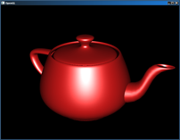

# Project 2 - Shading 

## Overview

Implement simple lighting and shading of 3D objects using WebGL. This project is divided into three main steps: displaying triangles, handling normals, and implementing Blinn-Phong shading.

---

## Steps

### Step 1: Display Triangles

- Load and parse vertex positions from an `.obj` file.
- Create and upload vertex position buffers to WebGL.
- Render triangles using `gl.drawArrays()` or `gl.drawElements()`.
- The rendered object should appear flat shaded, with no gaps between triangles.

### Step 2: Normal Buffer

- Load and upload vertex normals from the `.obj` file.
- In the vertex shader, transform normals by the inverse transpose of the model-view (camera) matrix (excluding projection).
- Pass the transformed normals to the fragment shader.
- Visualize normals by mapping their XYZ components to RGB colors:
  - X normal → Red
  - Y normal → Green
  - Z normal → Blue
- Clamp color values between 0 and 1.

### Step 3: Blinn-Phong Shading

- Implement Blinn-Phong lighting in the fragment shader with three components:
  - Ambient lighting
  - Diffuse lighting based on Lambert's cosine law
  - Specular highlights using the Blinn half-vector approach
- Material properties and light position can be hard-coded or passed as uniforms.
- Test ambient, diffuse, and specular components separately, then combine for final shading.

---

