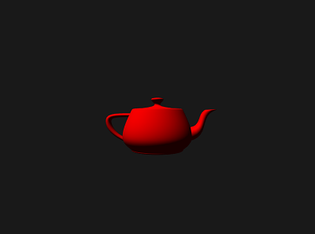

# Project 2 - Shading

Use WebGL to apply lighting and shading to 3D objects.

## Requirements

- Load `.obj` files with positions and normals   
- Normals transformed in vertex shader  
- Lighting in fragment shader  

