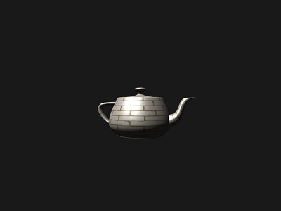

# Project 3 - Textures (WebGL)

Apply texture mapping to 3D models in WebGL using data from `.obj` and `.mtl` files.

## Requirements

- Load diffuse texture from `.mtl` file  
- Create buffer for texture coordinates  
- Map texture correctly on object  

## Optional

- Load and apply specular texture  
- Blinn-Phong lighting: ambient, diffuse, specular  

