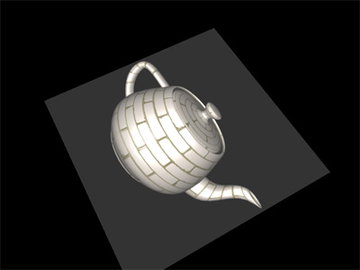

# Project 4 - Render Buffers 

In this project we will explore the render-to-texture features.

## Requirements
- Instead of rendering the object directly to the WebGL viewport, render the object **to a texture** using a framebuffer/render buffer.
- Use a framebuffer object (FBO) in WebGL to generate and use the render buffer.
- Display the rendered texture by mapping it onto a square-shaped plane (a quad).
- Controls:
  - **Left mouse button + drag:** adjust camera angles used for rendering the object to the texture.
  - **Right mouse button + drag:** adjust camera distance used for rendering the object to the texture.
  - If the **ALT/Option key** is pressed, the same mouse buttons and drag actions control the view parameters for rendering the plane instead.
- Add a small constant to the color of the plane to visually separate it from the background color.

