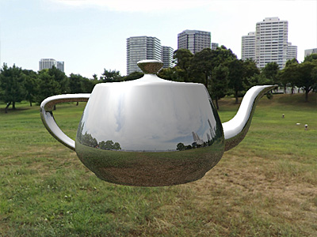

# Project 5 - Environment Mapping and Reflections

In this project we will implement simple environment mapping. This will include both the background and the reflections on objects.

## Requirements

- Combine cube-map reflections with Blinn shading on the loaded `.obj` (e.g., `teapot.obj`).

---

## Step 1: BDisplay the background

- Render a cube centered at the camera with the cube-map texture.
- Disable depth writes when drawing the cube.
- Rotate environment texture with the camera.

---

## Step 2: Sphere Reflections

- Render a sphere (`sphere.obj`) showing dynamic cube-map reflections matching the camera orientation.

---

## Step 3: Object Reflections

- Combine cube-map reflections with Blinn shading on the loaded `.obj` (e.g., `teapot.obj`).

---

## Notes

- Make sure the reflection calculations in the shader use the camera’s view direction and the surface normal.
- The cube-map texture sampling should correctly simulate environment reflections.
