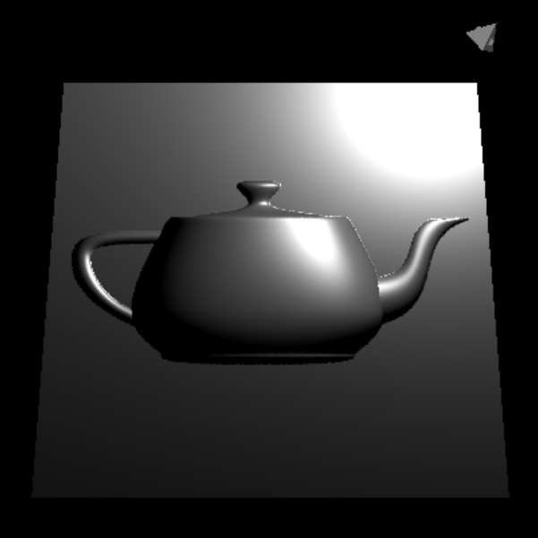
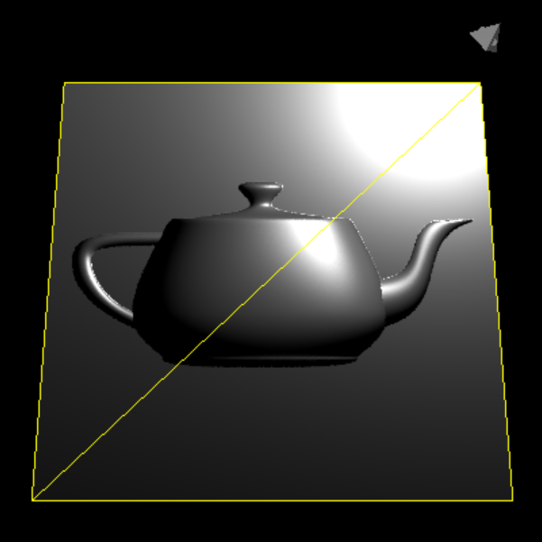
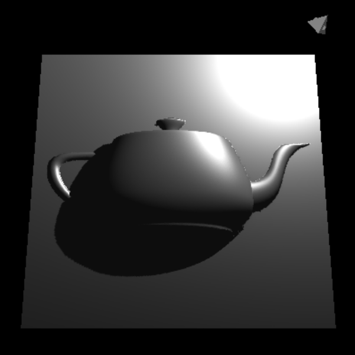
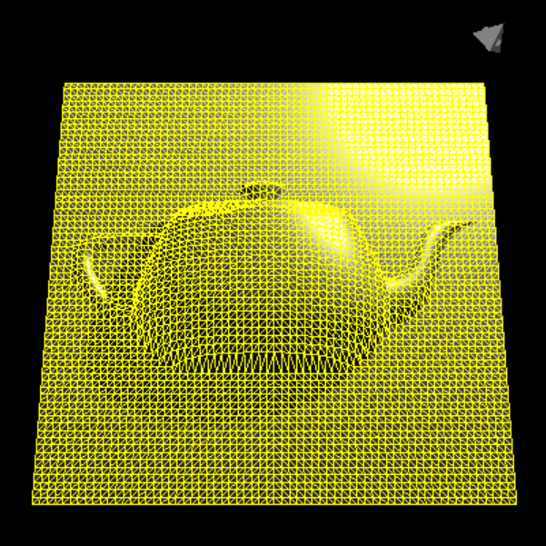
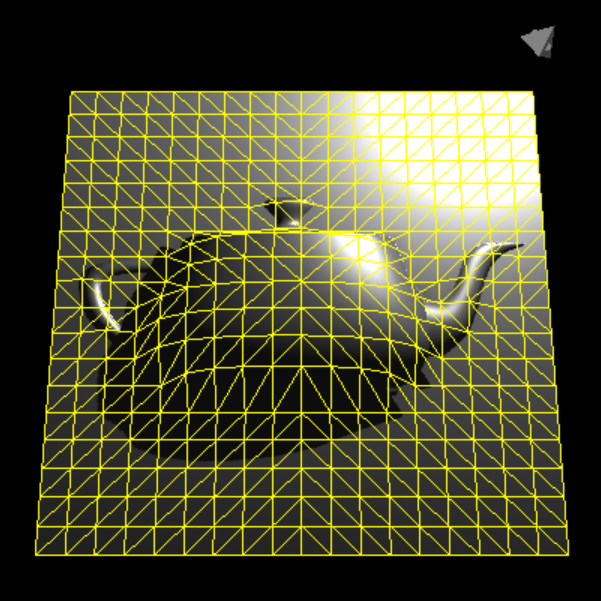

# Project 7 - Tessellation 

In this project we will implement simple normal mapping and displacement mapping. This project will include using both tessellation shaders and geometry shaders.

## Step 1: Normal Mapping

- Load a `.png` normal map as the first input.
- Draw a hard-coded quad.
- Use the normal map in the fragment shader to modify surface normals.
- Implement Blinn shading with diffuse and specular lighting.

## Step 2: Show Triangulation

- The quad consists of two triangles.
- Write a geometry shader that converts triangles into line segments to display edges.
- Draw the plane normally, then overlay the triangulation with the geometry shader.
- Offset lines slightly toward the camera to avoid z-fighting.
- Toggle triangulation display using the space key.

## Step 3: Displacement Mapping

- Load a second `.png` displacement map as the second input (optional).
- If no second input is given, skip displacement mapping.
- Use a tessellation shader to subdivide the plane.
- Control tessellation level with left/right arrow keys.
- Displace vertices upward based on the displacement map in the tessellation evaluation shader.
- Use the same geometry shader from Step 2 to display triangulation.
- Use space key to toggle triangulation display.

