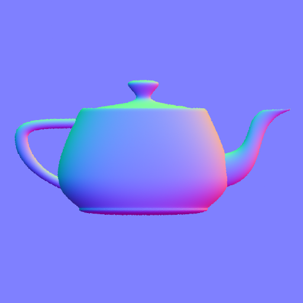

# Project 7 - Tessellation

Implement normal and displacement mapping using tessellation and geometry shaders in WebGL.

## Requirements

### Normal Mapping
- Load normal map (`.png`)  
- Draw hard-coded quad  
- Modify normals in fragment shader  
- Blinn shading with diffuse + specular  

### Triangulation (Geometry Shader)
- Convert triangles to lines to show edges  
- Overlay triangulation with slight offset  
- Toggle with space key  

### Displacement Mapping (Optional)
- Load displacement map (`.png`)  
- Use tessellation shader to subdivide quad  
- Displace vertices in evaluation shader  
- Control tessellation with arrow keys  
- Use same triangulation overlay  

  
